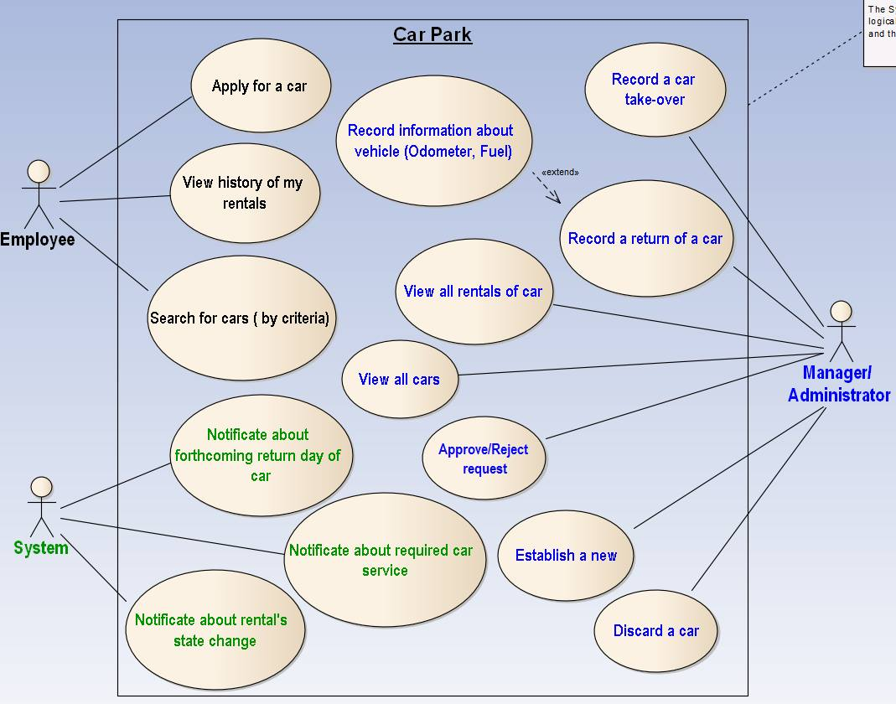
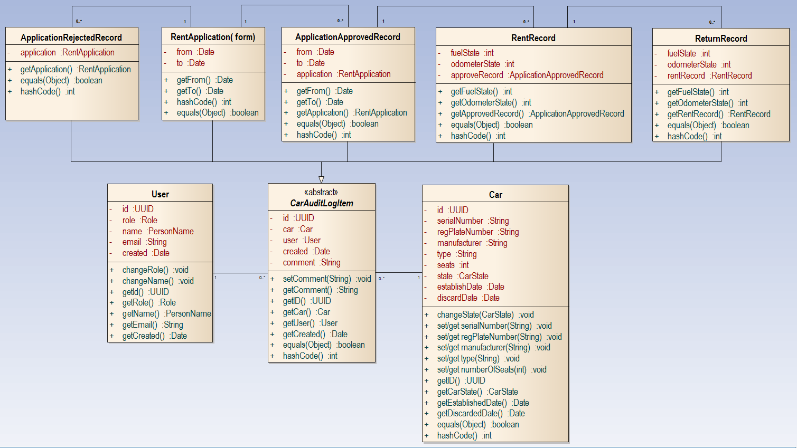
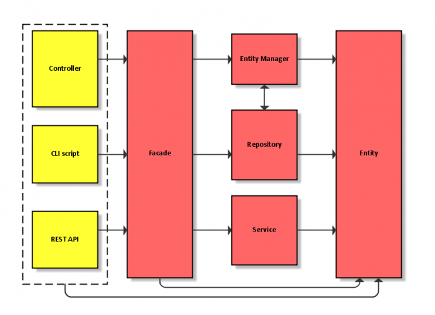

# Project PA165

Manages cars in company. Cars can be rented by employees. System should keep track of history of records about renting process and cars itself.

## Goals

- **build**: functional project
- **architecture**: use-case oriented
- **investigate**: how to build domain model as [Rich as possible](http://stackoverflow.com/questions/23314330/rich-vs-anemic-domain-model) (push behavior down into the model)

## Covered use-cases

roles:
- **employee**: in our [bounded context](http://martinfowler.com/bliki/BoundedContext.html) is person that can rent a car
- **administrator/manager** is a person that manages car inventory

# The Domain Model

Contains business logic of the system.

We use **rich domain model** which contains behavior (methods).

- **User**: Employee, manager or administrator
- **Car**: Basic information about every car company has in the inventory
- **Car Audit-log Item**: abstract representation of record that happened to Car and User.
- Audit log can have these members:
	- **Rent Application**: analogous to filled application form when someone wants to rent a car
		- **Application Rejected**: User cannot rent a car; company rejeted employee application
		- **Application Accepted**: Employee application was accepted --> can proceed
			- **Car Rented**: Employee claimed car
				- **Car Returned**: Employee returned car

Tip: The idea of "car log" is not dissimilar to [event sourcing](https://www.youtube.com/watch?v=JHGkaShoyNs).

## Technical: Model Top Level Architecture

### Responsibility of Entity

- **container** for data
- **validation** of input data (type conversion, etc.)
- **business logic** that depends only on **one** entity

### Responsibility of Repository
- repository of **saved queries** (e.g.: `findTopArticles()`)
  - returns **collection of object**
  - returns **pre-configured QueryBuilder**
- for complicated entities can have one class per query ([ref](http://www.rarous.net/weblog/377-domenove-dotazy.aspx))

### Responsibility of Service
- *optional*
- **business logic** that depend one **more** than one entity
- **state-less** (no properties except dependencies)
- **no** connection to **persistence layer**
- **using just data given through parameters** (e.g.: `getTopArticlesByMagic(array $articles, $maxResults)`)

### Responsibility of Facade
- public interface equals to **use-cases of the application**
- **persists data**
- should just **glue all parts together**
- can use private methods for common code base (but `flush()` must be called only on public/main ones)

## Other concepts used in the model

This section should be used mostly internally to clarify how we are going to the software.

### Entities

- Entity is thread of continuity defined by its ID. (defined by Eric Evans' book; [shortly described also at Fowler's blog](http://martinfowler.com/bliki/EvansClassification.html))
- **Every entity must be always in valid state.**
	- To ensure to have always valid ID we are using UUID which is generated in every entity constructor.

From definition of entity above, two entities are the same when they have the same ID. Thus implementation of `equals()` and `hashcode()` is straightforward - compute them from entity ID.

### Value Objects

Value Objects are 

> Objects that matter only as the combination of their attributes. Two value objects with the same values for all their attributes are considered equal. ([Martin Fowler; 14 December 2005](http://martinfowler.com/bliki/EvansClassification.html)) 

implementation: `equals()` and `hashcode()` needs to compute with all properties (from definition above)

- Used in user entity to describe users name: `PersonName`

### Unit vs integration test

What to test? Any valuable code. Typically contains business logic.

#### Unit test

- tests one unit **in isolation**
- consequence: can be run in parallel
- consequence: do not need any external resources (file-system, database, network, ...)
- typically written by developer in the same time as he is writing actual code
- goal: to prove that written code is actually working

#### Integration test

- test bigger part of the system (without isolation)
- consequence: they can be very slow (e.g.: set-up database for every test)
- consequence: they are unreliable (e.g.: network failure)
- goal: ensure that **interfaces** of classes when they work together are correct 